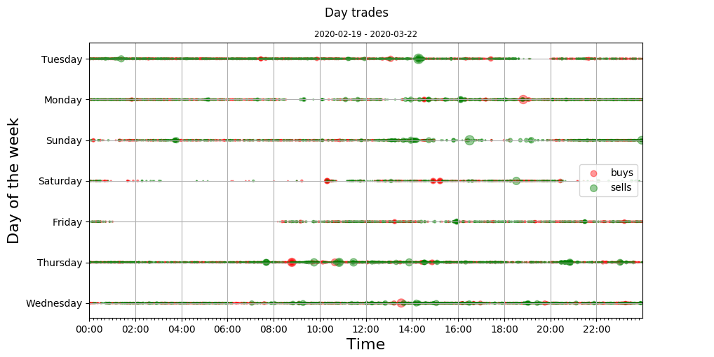
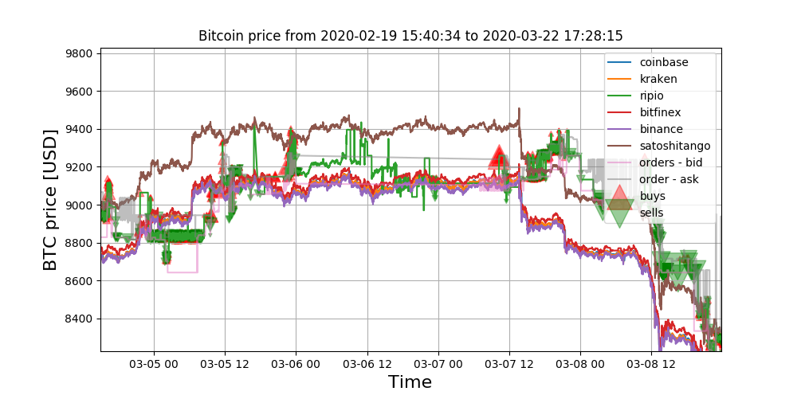

`btc_stats` does two things:

* Polls every minute several btc exchanges to get their current rate
* Polls every three minutes one exchange (ripio) to get the orderbook and the buys/sells operations

All the data is stored with sqlite3 and the scripts' output is stored in log files.

There's also two scripts that create a graphic using the data:

* Prices of all the exchanges mixed with the buy/sell operations
* Plots the hours of the day those buy/sell operations took place

## Updating

Both scripts pull `data` and `log` paths from a file which can change according to the environment the script is running. There's currently two files (in `conf/`) for development (`dev`) and production (`prod`)

To start the script to update rates:

`python -m btc_stats.update_exchanges <env_name>`

To start the script to update orderbook and buy/sell operations:

`python -m btc_stats.update <env_name>`

## Plots

`python -m btc_stats.plots.hours` will create something like this:

And `python -m btc_stats.plots.rates` will

## Status

This is an unfinished/abandoned project. 
